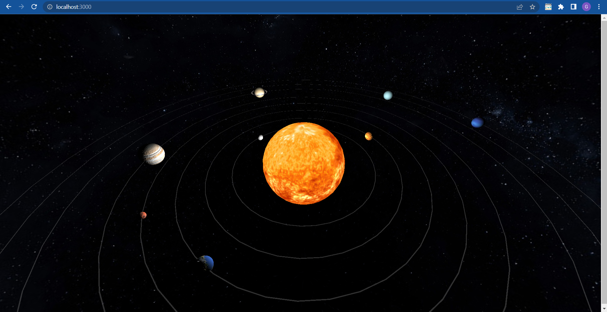

# Proyecto Final, Gráficas Computacionales

Proyecto que representa al sistema solar, conformado por el sol, los 8 planetas y estrellas en el fondo.

Desarrollado con WebGL utilizando la librería de Three.js.

## Avance 3 (6 de junio de 2022)
- Se agregaron e implementaron los bump maps para Mercurio, Venus, Tierra, Marte y Júpiter
- Se agregó una esfera gigante con un mapa de las estrellas para tener como fondo
- Ajuste de tamaño de los planetas y el Sol (semi-escala)
- Ajuste de distancias entre los planetas y el Sol (semi-escala)
- Ajuste de velocidad de rotación de planetas y el Sol (semi-escala)
- Se agregó una rotación de cada planeta al Sol, cada una con diferente velocidad (semi-escala)
- Se agregaron anillos que trazan el recorrido de rotación alrededor del Sol de cada planeta
- Se agregó un anillo a Saturno

## Avance 2 (30 de abril de 2022)
- Se agregaron las esferas correspondientes al Sol y a los planetas
- Se aplicaron texturas al Sol y a los planetas
- Se agregó una rotación predeterminada al Sol y los planetas

Cada esfera cuenta con su textura correspondiente y rota sobre su propio eje.
## Recursos utilizados

 - [Three.js](https://threejs.org/)
 - [Texturas del sol y planetas](https://www.solarsystemscope.com/textures/)
 - [Bump maps de Mercurio, Venus, Tierra, Marte y Júpiter](http://planetpixelemporium.com/planets.html)
 - [Vite](https://vitejs.dev/)

## Autor
Guillermo Andrés García Vázquez
- [@MemazoG](https://github.com/MemazoG)

## Ejecutar el proyecto localmente

#### Traer proyecto a ambiente local
Mediante `git clone` o descargando el ZIP del repositorio

#### Instalar dependencias
Acceder a carpeta sistema-solar y ejecutar el siguiente comando para que las dependencias sean instaladas: `npm i`

### Ejecutar proyecto
Escribir el siguiente comando para correr el proyecto: `npm run dev`. Estará disponible en localhost
